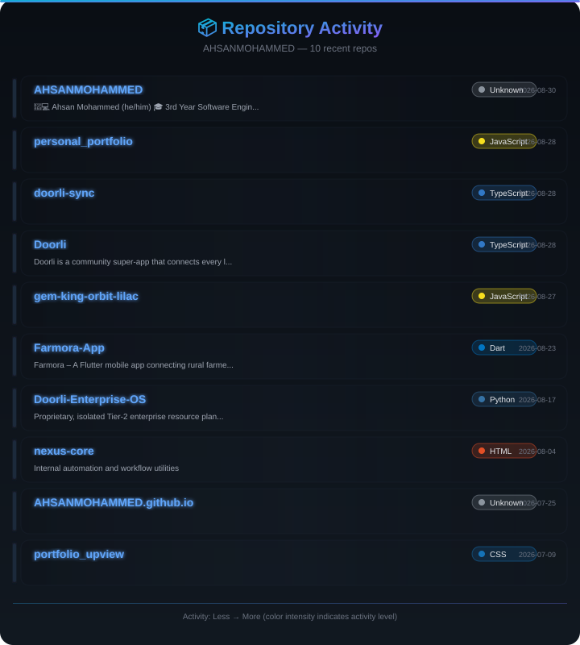
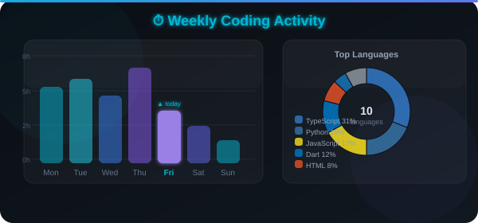

<div align="center">

<!-- PROFILE IMAGE -->
<a href="https://github.com/AHSANMOHAMMED">
  
</a>

<br/>
<br/>

<!-- TYPING SVG -->
<a href="https://git.io/typing-svg">
  
</a>

<br/>
<br/>

<!-- BADGES -->
[](https://github.com/AHSANMOHAMMED)
[](https://www.linkedin.com/in/ahsan-m-s-m-13048b324/)
[](mailto:ahsanmohammed828@gmail.com)
[](https://github.com/AHSANMOHAMMED)
[](https://github.com/AHSANMOHAMMED)

<br/>

> **Full-Stack Software Engineer | Mobile App Developer | Cloud & DevOps Enthusiast**
> Building scalable SaaS platforms, multi-tenant ERP/POS systems, and cross-platform mobile applications.
> Specializing in React, Next.js, Node.js, Flutter, TypeScript, PostgreSQL, Docker, and cloud deployment.
> Open to internships, collaborations, and software engineering opportunities in Sri Lanka and worldwide.

**🎓 3rd Year Software Engineering Student @ SLIIT, Sri Lanka 🇱🇰**
**💻 Building Doorli • Enterprise/ERP Systems • Flutter Applications**
**☁️ Docker • Linux • Nginx • GitHub Actions • Oracle Cloud Infrastructure**

<br/>

> 💡 *"Code is like humor. When you have to explain it, it's bad."* — Cory House

</div>

---

## 📌 Pinned Projects

<table>
<tr>
<td width="50%" valign="top">

### 🛵 [Doorli — Multi-Role Commerce Platform](https://github.com/AHSANMOHAMMED/Doorli)
**Multi-role local commerce & operations platform** — connecting customers, vendors, drivers, and operators.

<div align="center">


</div>

</td>
<td width="50%" valign="top">

### 🏢 [Doorli Enterprise OS](https://github.com/AHSANMOHAMMED/Doorli-Enterprise-OS)
**Enterprise operations & integration platform** — system integrations, workflows, and deployment automation.

<div align="center">


</div>

</td>
</tr>
<tr>
<td width="50%" valign="top">

### 🧾 [Retail Smart ERP](https://github.com/AHSANMOHAMMED/retail-smart-erp)
**Multi-tenant SaaS POS & ERP platform** — supporting retail, restaurants, supermarkets & dealerships.

<div align="center">


</div>

</td>
<td width="50%" valign="top">

### 🌾 [Farmora — Flutter Marketplace](https://github.com/AHSANMOHAMMED/Farmora-App)
**Flutter agricultural marketplace** — connecting farmers, buyers, and transport providers.

<div align="center">


</div>

</td>
</tr>
</table>

---

## 👨‍💻 About Me

I'm a **Software Engineering undergraduate at SLIIT, Sri Lanka** focused on building complete, real-world software products. My expertise spans **full-stack web development, mobile app engineering, cloud infrastructure, and DevOps automation**.

<table>
<tr>
<td width="50%" valign="top">

#### 🔭 What I'm Building
- 🛵 **Doorli** — Multi-role local commerce platform
- 🏢 **Enterprise OS** — Enterprise operations platform
- 🧾 **Retail Smart ERP** — Multi-tenant SaaS POS
- 🌾 **Farmora** — Flutter agricultural marketplace

</td>
<td width="50%" valign="top">

#### ⚡ Core Competencies
- 🏗️ Platform Architecture & System Design
- 🔐 Authentication, RBAC & Multi-Tenancy
- 📱 Flutter / React Native / Kotlin Mobile Apps
- ☁️ Docker, Linux, Nginx, Cloud Deployment

</td>
</tr>
</table>

---

## 🎨 Skills at a Glance

<div align="center">

<p>
<a href="https://skillicons.dev">

</a>
</p>

<p>
<a href="https://skillicons.dev">

</a>
</p>

<p>
<a href="https://skillicons.dev">

</a>
</p>

</div>

---

## 📊 GitHub Analytics

<div align="center">

[](https://github.com/AHSANMOHAMMED)
[](https://github.com/AHSANMOHAMMED)

</div>

<br/>

<div align="center">

[](https://git.io/streak-stats)

</div>

<br/>

<div align="center">

[](https://github.com/AHSANMOHAMMED)

</div>

---

## 📦 Repository Activity Heatmap

<div align="center">

<a href="https://github.com/AHSANMOHAMMED?tab=repositories">
  
</a>

</div>


---

## 🏙️ GitHub Skyline

<div align="center">

<a href="https://github.com/AHSANMOHAMMED">
  
</a>

</div>

---

## ⏱️ Weekly Coding Activity

<div align="center">

<a href="https://github.com/AHSANMOHAMMED">
  
</a>

</div>

---

## 🧩 Engineering Interests

<table>
<tr>
<td width="33%">

```
Full-Stack Development
├── React / Next.js
├── Node.js / Express
├── TypeScript / JavaScript
├── REST APIs
└── GraphQL
```

</td>
<td width="33%">

```
Platform Engineering
├── Multi-role applications
├── Authentication & RBAC
├── Service integrations
├── Real-time workflows
└── Event-driven systems
```

</td>
<td width="34%">

```
SaaS & ERP
├── Multi-tenancy
├── POS Systems
├── Inventory management
├── Business workflows
└── Tenant isolation
```

</td>
</tr>
<tr>
<td width="33%">

```
Mobile Engineering
├── Flutter / Dart
├── Riverpod
├── React Native / Expo
├── Kotlin / Android
└── Cross-platform
```

</td>
<td width="33%">

```
Infrastructure
├── Docker & Compose
├── Linux / Nginx
├── Oracle Cloud Infra
├── GitHub Actions CI/CD
└── Cloud-Native
```

</td>
<td width="34%">

```
Distributed Systems
├── Kafka
├── Redis
├── Elasticsearch
├── WebSockets
└── MinIO / PostGIS
```

</td>
</tr>
</table>

---

## 🏗️ System Architecture

<div align="center">

```
┌──────────────────────────────────────────────────────────────────────────┐
│                        👥  USERS / CLIENTS                              │
│              Web Apps  •  Mobile Apps  •  API Consumers                 │
└──────────────────────────────┬───────────────────────────────────────────┘
                               │
┌──────────────────────────────▼───────────────────────────────────────────┐
│                      🌐  API GATEWAY / PROXY                            │
│                  Nginx • Rate Limiting • SSL/TLS                        │
└──────────────────────────────┬───────────────────────────────────────────┘
                               │
┌──────────────────────────────▼───────────────────────────────────────────┐
│                     🔐  AUTH & AUTHORIZATION                            │
│               JWT • RBAC • Multi-Tenant Isolation                       │
└──────────┬───────────────────┼───────────────────┬──────────────────────┘
           │                   │                   │
┌──────────▼────────┐ ┌───────▼────────┐ ┌───────▼────────┐
│  📋  BUSINESS     │ │ 📡  EVENT &    │ │ 🔗  EXTERNAL   │
│      LOGIC        │ │    REAL-TIME   │ │  INTEGRATIONS  │
│                   │ │                │ │                │
│ • Orders          │ │ • Kafka        │ │ • Webhooks     │
│ • Inventory       │ │ • Redis Pub/Sub│ │ • Third-Party  │
│ • Payments        │ │ • WebSockets   │ │ • Payment GWs  │
│ • Users           │ │ • Elasticsearch│ │ • Delivery APIs│
└──────────┬────────┘ └───────┬────────┘ └───────┬────────┘
           │                   │                   │
┌──────────▼────────┐ ┌───────▼────────┐ ┌───────▼────────┐
│   🗄️  DATA LAYER  │ │   ⚡  CACHE &  │ │   📁  STORAGE  │
│                   │ │   MESSAGING    │ │                │
│ • PostgreSQL      │ │ • Redis Cache  │ │ • MinIO        │
│ • PostGIS         │ │ • Kafka Queues │ │ • File Storage │
│ • MongoDB         │ │ • Elasticsearch│ │ • Backups      │
└───────────────────┘ └────────────────┘ └────────────────┘
                               │
┌──────────────────────────────▼───────────────────────────────────────────┐
│                   🏗️  INFRASTRUCTURE & DEPLOYMENT                       │
│      Docker Compose • Linux • Nginx • GitHub Actions • Oracle Cloud     │
└──────────────────────────────────────────────────────────────────────────┘
```

</div>

---

## 🎯 Career Direction

I'm looking for opportunities where I can contribute to **real software products** while continuing to grow as a software engineer.

<div align="center">

**SaaS** · **Commerce** · **ERP** · **POS** · **Logistics** · **Mobile** · **Cloud** · **Platform Engineering** · **AI-Enabled Applications**

</div>

---

## 🤝 Let's Connect

<div align="center">

<a href="https://github.com/AHSANMOHAMMED">
  
</a>

<br/>

[](https://www.linkedin.com/in/ahsan-m-s-m-13048b324/)
[](https://github.com/AHSANMOHAMMED)
[](mailto:ahsanmohammed828@gmail.com)

<br/>


</div>

---

<div align="center">

### 💻 Build useful software. Learn continuously. Engineer for real-world impact.

</div>
